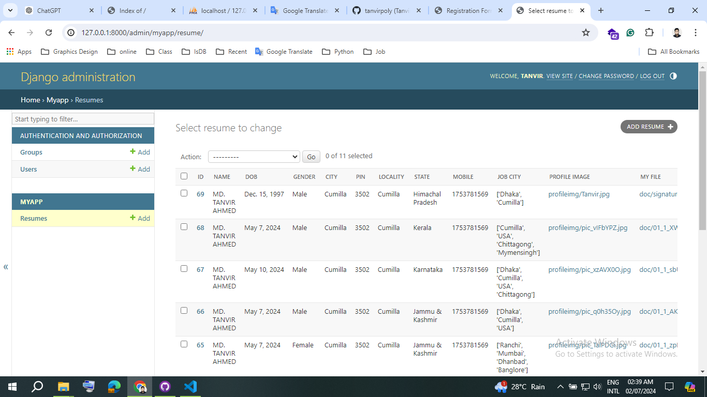
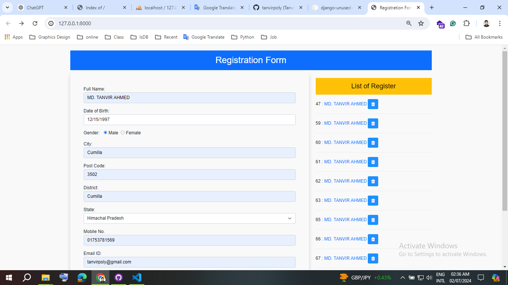
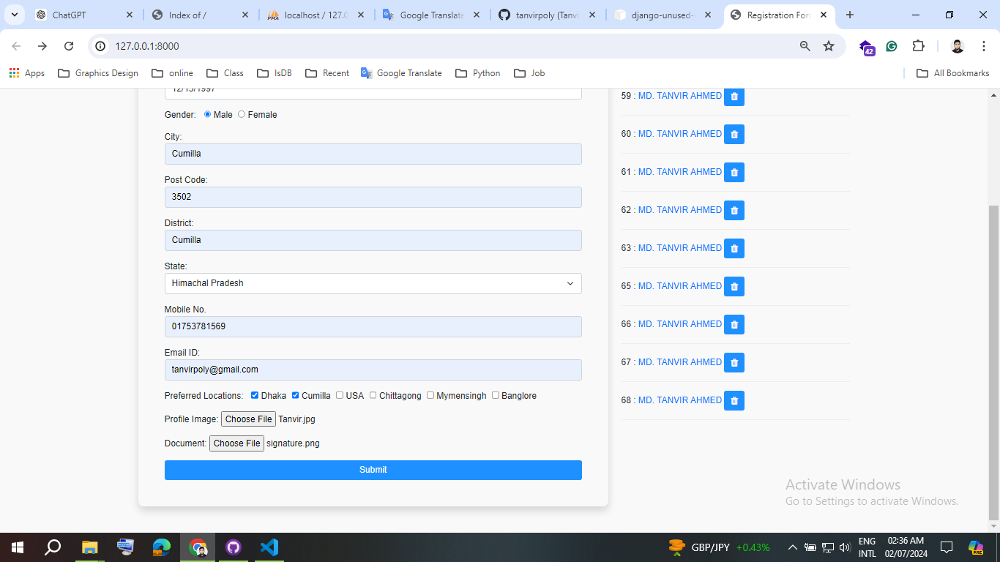
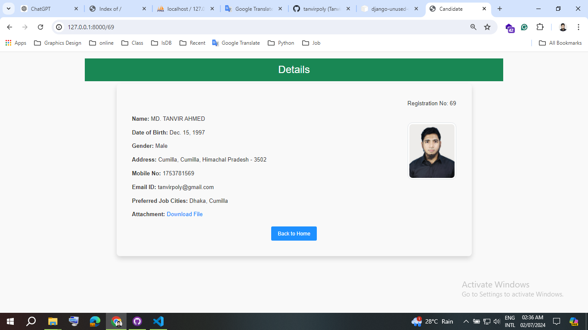

# to start
# Registration_Form_Using_Python_Django
 Registration Form Using Python django


```
git clone
python -m venv venv
pip install ir requirements.txt
```


# Output


---
<h1>Visit Live: https://github.com/tanvirpoly/Registration_Form_Using_Python_Django</h1>


---





---



---



---



---


<!-- all link is here -->


### Contact me:

[E-mail]( tanvirpoly@gmail.com)

[Linkedin]( https://www.linkedin.com/in/tanvirx/)

[Facebook]( https://www.facebook.com/tanvirfbid)
